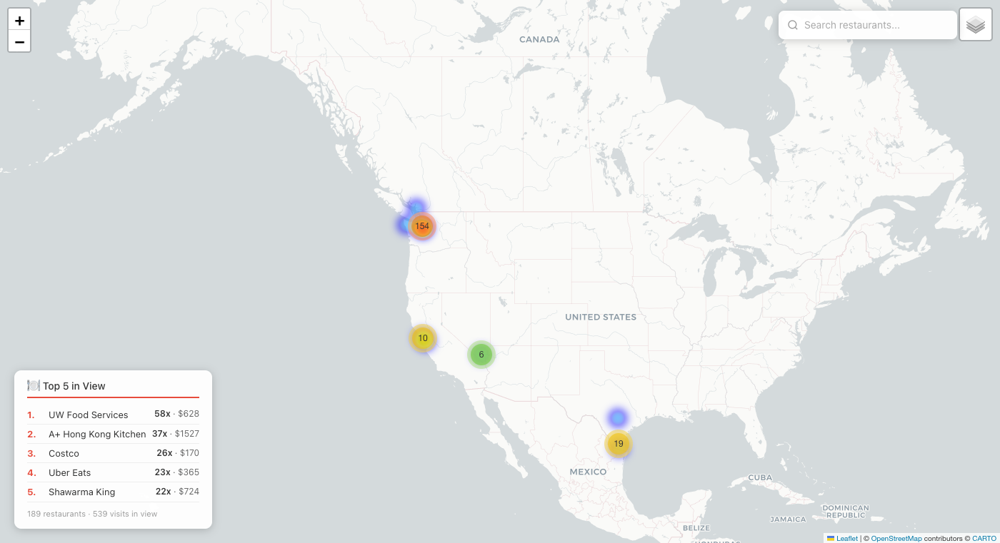
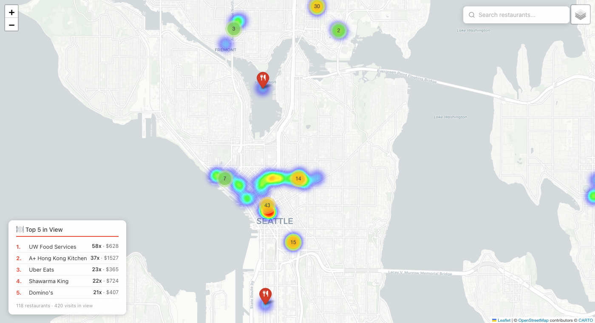

# Restaurant Dining Heatmap

An interactive heatmap visualization of all restaurants I've dined at, built from personal transaction data.

**[Live Demo](https://rubywu-ux.github.io/restaurant-heatmap/restaurant_heatmap.html)** | **[Seattle Detail](https://rubywu-ux.github.io/restaurant-heatmap/restaurant_heatmap_seattle.html)**


## Screenshots

### Global View
All dining locations across the US, Canada, Japan, Thailand, and South Korea.



### Seattle Detail
Zoomed into the Seattle metro area where most dining is concentrated.



## Overview

This project parses bank/credit card transaction data and Uber Eats order history to extract restaurant visits, geocode them, and generate an interactive heatmap showing dining locations across multiple cities.

### Features

- Extracts and deduplicates restaurant transactions from CSV export
- Parses Uber Eats order history from Safari `.webarchive` export
- Geocodes ~200 unique restaurants with manually curated coordinates
- Generates two interactive Folium maps:
  - **Global heatmap** — all dining locations worldwide
  - **Seattle detail map** — zoomed into the Seattle metro area
- Heatmap weighted by visit frequency
- Clickable markers with restaurant name, city, visit count, and total spend
- **Search bar** — find any restaurant by name or city, click to fly to its location
- **Top 5 panel** — dynamically shows the top 5 most-visited restaurants in the current map view

## Data Sources

- **Transaction data**: Exported from [Copilot Money](https://copilot.money) as CSV
- **Uber Eats history**: Saved from [Uber Eats](https://www.ubereats.com/orders) Past Orders page as a Safari `.webarchive` file

## Setup

### Requirements

- Python 3.9+
- `folium` library

### Install

```bash
pip install folium
```

### Data Preparation

1. Export your transactions from Copilot Money as CSV. The expected format:

```
date,name,amount,category,parent category,tags,account,account mask,note
```

See `sample_transactions.csv` for an example.

2. (Optional) Save your Uber Eats Past Orders page as a `.webarchive` file from Safari.

### Usage

```bash
# Step 1: Extract text from Uber Eats webarchive (optional)
python3 extract_webarchive.py

# Step 2: Extract and deduplicate restaurant list
python3 extract_restaurants.py

# Step 3: Build the heatmap
python3 build_heatmap.py
```

This generates:
- `restaurant_heatmap.html` — global view
- `restaurant_heatmap_seattle.html` — Seattle area detail

Open either HTML file in a browser to explore the interactive map.

## Project Structure

```
├── screenshots/                   # Screenshots for README
│   ├── global_heatmap.png
│   └── seattle_heatmap.png
├── build_heatmap.py              # Main script: geocode + generate heatmaps
├── extract_restaurants.py        # Extract/deduplicate restaurants from CSV
├── extract_webarchive.py         # Parse Uber Eats .webarchive file
├── sample_transactions.csv       # Example CSV format (fake data)
├── restaurant_heatmap.html       # Generated global heatmap
├── restaurant_heatmap_seattle.html # Generated Seattle heatmap
└── README.md
```

## Customization

- Edit the `KNOWN_COORDS` dictionary in `build_heatmap.py` to add/fix restaurant coordinates
- Modify `FALSE_POSITIVES` to exclude non-restaurant transactions
- Adjust heatmap `radius`, `blur`, and `max_zoom` parameters for different visual styles

## Privacy

Transaction data (`transactions.csv`), Uber Eats history (`.webarchive`), and extracted files containing personal spending information are excluded via `.gitignore`.
